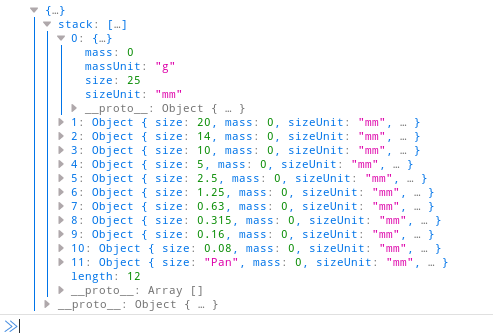

# geotech-utils
A library of utilities for geotechnical analysis and lab calculations written in JavaScript

## module: sieve.js
Contains helper classes for storing the results of a grain size analysis (or sieve) test.

#### Background:
A grain size analysis is a common laboratory test used to help determine the engineering properties of soil and aggregate. A soil sample is mechanically sorted using a stack of sieves, and each sieve retains particles of a different size. The results indicate the percentage of gravels, sands, and fine particles (i.e. silt and clay) in the sample.

#### Usage:
```javascript
import { SieveStack } from 'sieve';

// create an array containing the sizes (in mm) of each sieve
const sizes = [25, 20, 14, 10, 5, 2.5, 1.25, 0.630, 0.315, 0.160, 0.08];

// pass in the sizes array (using an object) to create a new SieveStack object
const stack = new SieveStack({ sizes });
```
**Result:**



**Work in progress!** Roadmap:
* `SieveStack.prototype.passing()` - calculates percent passing for each sieve in the stack and returns the results as an array

#### Development:
To install dev dependencies and run unit tests, clone this repository and run:
```bash
npm install
npm run test
```
